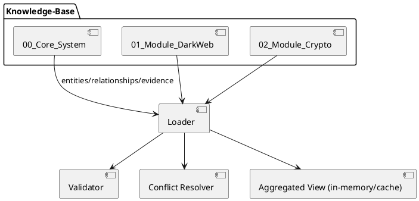
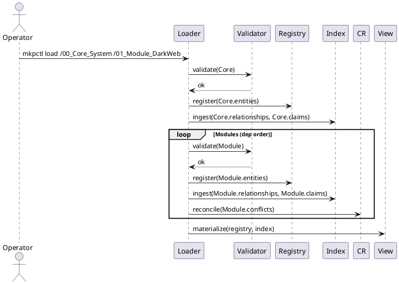
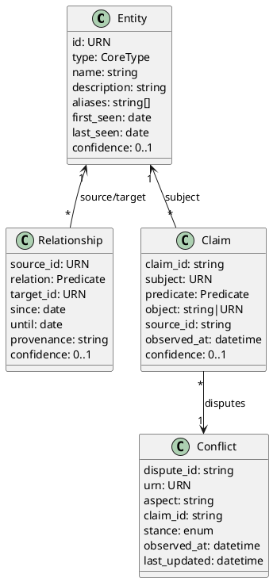

# SPEC-001-Modular Knowledge Platform (Core + Modules)

## Background

The goal is to evolve the current Hybrid RAG dataset into a **Modular Knowledge Platform** where the **Defensive Privacy** corpus acts as the Core Operating System and domain-specific knowledge (e.g., Dark Web Intelligence) is delivered as add-on **Expansion Modules**. This separation aims to:

- Reduce semantic noise by keeping foundational ontology/logic isolated from domain data.
- Improve reasoning by enabling sequential loading: Core → Module(s) with explicit cross-links.
- Simplify maintenance through versioned modules, repeatable validation, and deterministic packaging.
- Preserve the logic of Defensive Privacy Methods while allowing independent growth of adjacent domains.

## Requirements (MoSCoW)

**Must**

- **Directory layout**: `00_Core_System` + `NN_Module_*` (each module has `graph/`, `evidence/`, optional `conflict_resolution/`, `narrative/`).
- **Shared CSV schemas** across Core and Modules:
  - `graph/entities.csv`: `id, type, name, description`.
  - `graph/relationships.csv`: `source_id, relation, target_id`.
  - `evidence/claims.csv`, `evidence/sources.csv`, `evidence/timeline.csv` (inherit Core schemas as-is).
  - `conflict_resolution/conflicts.csv` (standardized; schema to be defined in Method).
- **Canonical URNs** with namespacing to prevent collisions:
  - Core: `urn:entity:<core-category>:<slug>` (e.g., `mfa`, `payment`, `adversary`).
  - Module: `urn:entity:<module-namespace>:<module-category>:<slug>` (e.g., `darkweb:market:hydra`).
- **Cross-linking**: Module relationships may reference Core URNs; Core must remain the single source of truth for shared concepts.
- **Loader**: Deterministic load order (Core → Modules). Enforce referential integrity, preserve module boundaries, and build an aggregated view without mutating source files.
- **Validation**: A CLI validator that checks schema conformance, URN format, referential integrity, duplicate detection, and (if present) conflict coverage for disputed claims.
- **Manifest**: Each module MUST include `module.yaml` with `module_id`, `namespace`, `version` (semver), `compatible_core`, `depends_on` (optional), `maintainers`, `license`, and `hashes` for integrity.
- **Mappings**: Publish `labels_to_urn.csv` at the root and allow per-module `labels_to_urn.csv` for local synonyms.

**Should**

- Provide `aliases.csv` per module for synonym expansion and entity consolidation.
- Provide `narrative` (`*.md`) per module for RAG grounding (e.g., PACKET/Report docs).
- Maintain a predicate catalog (optionally URN-ized) for consistent relations.

**Could**

- Add `qa/` with unit tests (gold triples, referential checks, conflict scenarios).
- Provide embeddings caches per module for faster retrieval warm-start.

**Won’t**

- Auto-merge module data into Core artifacts; aggregation occurs at runtime/loader stage only.

## Method

### 1) Schemas & Namespacing

**Core provides the Ontology.** Core defines the canonical *types* (e.g., `Threat_Actor`, `Marketplace`, `Payment_Method`, `Mechanism`, `Control`, `Predicate`). Modules instantiate domain entities but **must reuse Core types** where applicable.

**URN Heuristic**

- **Core URNs (3 segments)**: `urn:entity:<core-category>:<slug>` → e.g., `urn:entity:mfa:fido2`, `urn:entity:payment:bitcoin`.
- **Module URNs (4 segments)**: `urn:entity:<module-namespace>:<module-category>:<slug>` → e.g., `urn:entity:darkweb:market:hydra`.

**CSV Schemas (shared headers, extensible)**

- `graph/entities.csv`
  - Required: `id, type, name, description`
  - Optional: `aliases` ("|"-delimited), `source_ids` ("|"-delimited), `first_seen`, `last_seen`, `confidence`, any custom `x_*` columns.
- `graph/relationships.csv`
  - Required: `source_id, relation, target_id`
  - Optional: `since, until, provenance, confidence`, any `x_*` columns.
- `evidence/claims.csv` (same as Core; includes `claim_id, subject, predicate, object, source_id, observed_at, confidence`).
- `evidence/sources.csv` and `evidence/timeline.csv` (inherited from Core).
- `conflict_resolution/conflicts.csv` (optional but recommended)
  - Minimal schema: `dispute_id, urn, aspect, claim_id, stance, source_id, observed_at, last_updated, notes`
  - `stance` ∈ {`supports`, `refutes`}; `aspect` may be `attribute:<field>` or `relation:<predicate>`.

**Module Manifest (`module.yaml`)**

```yaml
module_id: darkweb
namespace: darkweb
version: 1.0.0
compatible_core: ">=1.0.0, <2.0.0"
depends_on: [crypto]
last_updated: 2026-01-15
maintainers:
  - name: Analyst Team DW
    contact: dw@example.org
license: CC-BY-4.0
hashes:
  graph/entities.csv: sha256:...
  graph/relationships.csv: sha256:...
  evidence/claims.csv: sha256:...
loader_directives:
  conflict_policy: [core_immutable, prefer_fresh, prefer_higher_source_confidence]
  predicate_catalog: strict
```

**Namespace Isolation**

- Modules may **extend** Core entities *via relationships* but must **not mutate** Core attributes. Attempting to redefine a Core entity’s `name/description/type` is invalid.
- **Dangling Reference Check**: Every `source_id`/`target_id` in module relationships must resolve either inside the module or in Core.

**Predicate Catalog (Core-owned, STRICT)**

- Core publishes `predicates.csv` (authoritative Standard 12): `id, label, description, domain, range, inverse_of?`
- Modules **must not** introduce new or namespaced predicates; any extension requires a Core PR to update the catalog.
- Loader enforces `relation` ∈ catalog (strict mode) and rejects unknown verbs.

**Label Lookup**

- Root-level `labels_to_urn.csv` (global) plus optional per-module `labels_to_urn.csv` enable synonym → URN resolution at load time.

---

### 2) Loader Algorithm (Core → Modules)

**Goals**: deterministic order, referential integrity, immutability of Core, cross-linking, conflict surfacing, aggregated runtime view (no monolithic merge on disk).

**Pseudo-code (CLI: `mkpctl`)**

```python
# Inputs: core_dir, modules_dirs[]
registry = {
  'entities': {},    # urn -> {id, type, name, ...}
  'predicates': {},
}
index = {
  'relationships': [],
  'claims': [],
  'conflicts': [],
}

# 1) Load Core
core = load_manifest(core_dir)
validate_schema(core)
load_entities(core, into=registry, namespace='core')
load_predicates(core, into=registry)
load_relationships(core, into=index, resolver=registry)
load_evidence(core, into=index)

# 2) Load Modules (sorted by module_id, respecting depends_on)
ordered = topo_sort_by_dependencies(modules_dirs)
for mod_dir in ordered:
    manifest = load_manifest(mod_dir)
    assert compatible(manifest.compatible_core, core.version)
    validate_schema(mod_dir)
    # 2a) Register module entities (no mutation of Core ids)
    for e in read_entities(mod_dir):
        assert is_module_urn(e.id)
        assert not exists_in_core(e.id)
        registry['entities'][e.id] = e
    # 2b) Relationships (cross-linking allowed)
    for r in read_relationships(mod_dir):
        assert resolve_urn(r.source_id, registry)
        assert resolve_urn(r.target_id, registry)
        assert predicate_ok(r.relation, registry, manifest)
        index['relationships'].append(r)
    # 2c) Evidence and conflicts
    index['claims'] += read_claims(mod_dir)
    index['conflicts'] += read_conflicts(mod_dir)

# 3) Build Aggregated Runtime View (in-memory or cache)
view = materialize_view(registry, index)
# - Optionally write cached artifacts under /aggregated/ for downstream RAG
```

**Referential Integrity & Immutability Checks**

- `is_core_urn(x)` when segments==3; `is_module_urn(x)` when segments==4.
- Reject any module entity whose URN collides with an existing Core URN.
- Fail the load if any relationship/claim references an unknown URN.

**Conflict Handling**

- **Policy order (default)**: `core_immutable` → `prefer_fresh (module.last_updated)` → `prefer_higher_source_confidence` → `tie=flag`.
- Conflicts don’t delete data; they create a **conflict index** the retriever can surface as disclaimers.

---

### 3) PlantUML Diagrams

**Component Diagram**



**Sequence: Layered Loading**



**Class (Schemas)**



---

### 4) Dark Web Module Illustration (minimal)

`01_Module_DarkWeb/graph/entities.csv`

```csv
id,type,name,description
urn:entity:darkweb:market:hydra,Marketplace,Hydra,Large RU-language darknet market
urn:entity:darkweb:actor:darkoverlord,Threat_Actor,The Dark Overlord,Ransomware/extortion group
urn:entity:darkweb:service:escrow,Service,Escrow Service,Marketplace escrow capability
```
```csv
id,type,name,description
urn:entity:darkweb:market:hydra,Marketplace,Hydra,Large RU-language darknet market
urn:entity:darkweb:actor:darkoverlord,Threat_Actor,The Dark Overlord,Ransomware/extortion group
```

`01_Module_DarkWeb/graph/relationships.csv`

```csv
source_id,relation,target_id
urn:entity:darkweb:market:hydra,PROVIDES,urn:entity:darkweb:service:escrow
urn:entity:darkweb:service:escrow,RELATED_TO,urn:entity:payment:bitcoin
urn:entity:darkweb:actor:darkoverlord,AFFILIATED_WITH,urn:entity:darkweb:market:hydra
```
```csv
source_id,relation,target_id
urn:entity:darkweb:market:hydra,USES_PAYMENT,urn:entity:payment:bitcoin
urn:entity:darkweb:actor:darkoverlord,OPERATES_ON,urn:entity:darkweb:market:hydra
```

`01_Module_DarkWeb/conflict_resolution/conflicts.csv`

```csv
dispute_id,urn,aspect,claim_id,stance,source_id,observed_at,last_updated,notes
DW-0001,urn:entity:darkweb:market:hydra,attribute:market_share,CLM-123,refutes,SRC-4,2021-11-01,2026-01-15,"Market share disputed"
```

---

### 5) Output Artifacts for RAG

- **Registry/Index** (in-memory): Unified entity registry + relationship/claim/conflict index.
- **Optional cache** under `/aggregated/` for retrieval (keeps module boundaries via `source_module` column).
- **Prompts** can reference load sequence explicitly ("Load Core → DW Module"), and use the conflict index to caveat answers.

## Implementation

### A) Repository layout & packaging

```
/Knowledge-Base
├── 00_Core_System/
│   ├── graph/
│   │   ├── entities.csv
│   │   ├── relationships.csv
│   │   └── predicates.csv   # Standard 12
│   ├── decision/
│   │   └── security_control_matrix.csv
│   ├── evidence/
│   │   ├── claims.csv
│   │   ├── sources.csv
│   │   └── timeline.csv
│   ├── narrative/
│   │   └── privacy_report_structured.md
│   ├── labels_to_urn.csv
│   └── module.yaml          # module_id=core, namespace=core, version, last_updated
├── 01_Module_DarkWeb/
│   ├── graph/{entities.csv,relationships.csv}
│   ├── evidence/{claims.csv,sources.csv,timeline.csv}
│   ├── conflict_resolution/conflicts.csv
│   ├── narrative/PACKET.md
│   ├── labels_to_urn.csv
│   └── module.yaml
└── aggregated/               # build outputs (materialized view, logs)
    ├── registry.sqlite
    ├── entities.csv
    ├── relationships.csv
    ├── claims.csv
    ├── conflicts.csv
    ├── conflict_index.csv
    └── conflict_log.csv
```

### B) Standard 12 predicates (Core catalog)

`00_Core_System/graph/predicates.csv` (authoritative) — any non-listed predicate causes loader rejection.

| id               | label            | description                    |
| ---------------- | ---------------- | ------------------------------ |
| IS\_A            | IS\_A            | Hierarchy/type assertion       |
| USES             | USES             | General consumption/usage      |
| PROVIDES         | PROVIDES         | Capability/service offering    |
| MITIGATES        | MITIGATES        | Defensive control reduces risk |
| EXPLOITS         | EXPLOITS         | Uses a vulnerability/CVE       |
| TARGETS          | TARGETS          | Victimology/target class       |
| LOCATED\_IN      | LOCATED\_IN      | Geo/jurisdiction               |
| AFFILIATED\_WITH | AFFILIATED\_WITH | Group membership/ownership     |
| BLOCKS           | BLOCKS           | Technical restriction          |
| REQUIRES         | REQUIRES         | Dependency/prerequisite        |
| CONFLICTS\_WITH  | CONFLICTS\_WITH  | Incompatibility                |
| RELATED\_TO      | RELATED\_TO      | Weak/associative link          |

### C) Validation rules (fast fail)

- **URN regex**
  - Unified: `^urn:entity:([a-z0-9_]+):([a-z0-9_]+)(?::([a-z0-9_]+))?$` (3 segments = Core, 4 = Module)
  - Heuristic: segments==3 → Core; segments==4 → Module.
- **Schema**: required headers per file; allow additional `x_*` columns.
- **Namespaces**: module entity IDs must not collide with any Core ID; module may **extend** via relationships but must not mutate Core entity attributes.
- **Predicates**: every relationship `relation` must exist in `predicates.csv`.
- **Dangling references**: any `source_id`/`target_id` must resolve in Core ∪ currently loaded modules.
- **Depends-on**: topological order from `module.yaml.depends_on`; missing dep → reject.
- **Compatibility**: `compatible_core` evaluated against `00_Core_System/module.yaml.version`.

### D) Conflict policy & logging (approved)

Policy chain: `core_immutable → prefer_fresh → prefer_higher_source_confidence → flag`.

- **Inputs**: core/module claims; optional `conflict_resolution/conflicts.csv` rows.
- **Outputs**:
  - `aggregated/conflict_index.parquet`: structured disputes used by the retriever.
  - `aggregated/conflict_log.csv`: every auto-resolution event (who won/why) + all ties flagged for analyst review.
  - `reason_code` ∈ {`core_immutable`, `prefer_fresh`, `prefer_higher_source_confidence`, `tie_flag`}.

### E) CLI & package structure (Python 3.11+)

```
mkp/
  __init__.py
  cli.py                 # argparse Typer/Click
  loader.py              # load_core(), load_module(), topo_sort()
  validate.py            # schema + URN + predicate checks
  predicates.py          # load & cache Standard 12
  urns.py                # regex & helpers: is_core(), is_module()
  index.py               # in-memory registry + parquet/sqlite writers
  conflicts.py           # policy, tie-breakers, conflict_log.csv
  manifest.py            # module.yaml schema + compat logic
  schema_defs.py         # required columns, dtypes
```

**Commands**

```
# Validate
mkpctl validate /Knowledge-Base/00_Core_System /Knowledge-Base/01_Module_DarkWeb --strict-predicates

# Load & aggregate (CSV + SQLite); add --no-sqlite to skip DB
mkpctl load /Knowledge-Base/00_Core_System /Knowledge-Base/01_Module_DarkWeb \
  --out /Knowledge-Base/aggregated --strict-predicates

# Merge label lookups
mkpctl build-labels --root /Knowledge-Base --out /Knowledge-Base/aggregated/labels_to_urn_merged.csv

# Create a fresh demo KB (Core + DarkWeb) and aggregate it
mkpctl demo ./my-kb

mkpctl load /Knowledge-Base/00_Core_System /Knowledge-Base/01_Module_DarkWeb \
  --write-parquet --write-sqlite --strict-predicates

mkpctl validate /Knowledge-Base/01_Module_DarkWeb

mkpctl build-labels --root /Knowledge-Base --out /Knowledge-Base/aggregated/labels_to_urn_merged.csv
```

### F) Key algorithms (concise)

**Topological sort (modules)**: DFS over `depends_on`; error on cycle.

**Referential resolver**: hash map `urn → entity`; per-module insertion ensures Core shadowing is impossible; relationships validated as they stream.

**Predicate check**: set-membership against Standard 12 cached in memory.

**Conflict resolution**:

1. Group by `(subject, predicate)` where objects disagree.
2. If any claim originates from Core → choose Core (`core_immutable`).
3. Else select **freshest** `observed_at` (module `last_updated` as tie-breaker).
4. If still tied → select highest `confidence`.
5. If still tied → write `tie_flag` row; keep both in index and mark for retrieval-time caveat.

**Performance**: streaming CSV reader; relationships validated row-by-row; entities pre-indexed; O(N) over rows.

### G) Minimal module template (contractors can copy)

```
<NN>_Module_<Name>/
├── module.yaml
├── graph/
│   ├── entities.csv           # id,type,name,description
│   └── relationships.csv      # source_id,relation,target_id
├── evidence/
│   ├── claims.csv             # claim_id,subject,predicate,object,source_id,observed_at,confidence
│   ├── sources.csv
│   └── timeline.csv
├── conflict_resolution/
│   └── conflicts.csv          # optional
├── narrative/
│   └── REPORT.md
└── labels_to_urn.csv          # optional synonyms
```

### H) Example validators (error codes)

- `E100` schema missing column
- `E110` invalid URN pattern
- `E120` predicate not in catalog
- `E130` dangling reference
- `E140` module attempts to mutate Core entity
- `E150` dependency not satisfied
- `E160` incompatible core version

### I) SQLite materialization (optional powerhouse)

- Tables: `entities(id PRIMARY KEY, type, name, description, source_module)`, `relationships(source_id, relation, target_id, source_module)`, `claims(...)`, `conflicts(...)`.
- Composite indices: `(relation, target_id)`, `(source_id, relation)` for fast neighborhood queries.
- Enables direct `SELECT` for deterministic tests and ad-hoc analytics.

### J) Packaging & CI/CD
- **Distribution**: Provided as a dependency-free wheel with console entrypoint `mkpctl`.
- **Versioning**: Wheel version `1.0.0` aligns with Core compatibility `>=1.0.0, <2.0.0`.
- **Demo**: `mkpctl demo <out_dir>` scaffolds a Core + DarkWeb KB and runs `load` to produce aggregates.
- **CI Gate**: Add `.github/workflows/mkp-audit.yml` to auto-run `demo`, `validate`, `load`, and static audits (URN regex, Standard 12, and `conflict_log.csv` header check).

---

## Milestones

1. **M0 — Predicate Catalog & URN foundation (1 week)**
   - Deliver `predicates.csv`, URN regex helpers, `module.yaml` schema.
   - Acceptance: loader rejects any non-Standard-12 predicate; URN tests pass.
2. **M1 — Validator + Loader MVP (2 weeks)**
   - Implement `mkpctl validate` & `mkpctl load` (Core only, then Core+1 Module).
   - Acceptance: runs on Core + DarkWeb sample; produces aggregated parquet/sqlite.
3. **M2 — Conflict engine & logs (1 week)**
   - Implement policy chain + `conflict_index.parquet` + `conflict_log.csv`.
   - Acceptance: synthetic tests cover each reason\_code path.
4. **M3 — Tooling polish & docs (1 week)**
   - `build-labels` command, module template generator, README + examples.
   - Acceptance: contractor can build a new module from template and pass `mkpctl validate` on first try.

## Gathering Results

- **Data hygiene**: referential integrity = 100%, schema pass rate ≥ 99%.
- **Conflict transparency**: 100% of ties logged; analyst turnaround time ↓.
- **Retrieval quality**: nDCG\@10 on cross-domain questions (Core + DarkWeb) ≥ baseline + X%.
- **Latency**: Core+DW load under N seconds on 1e6 rows (streaming).
- **Stability**: strict predicate catalog blocks drift; number of predicate PRs per quarter tracked.
